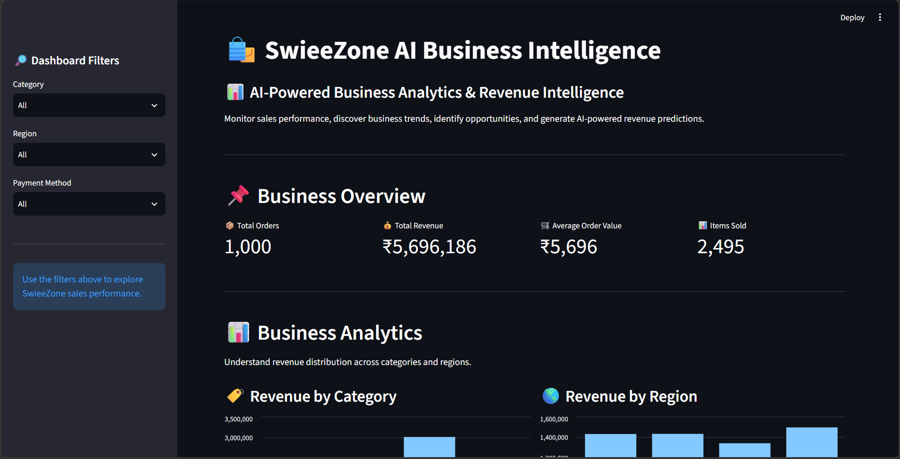
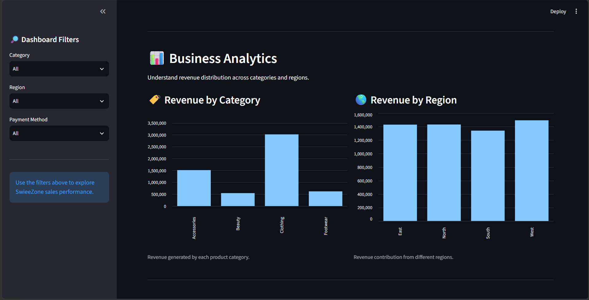
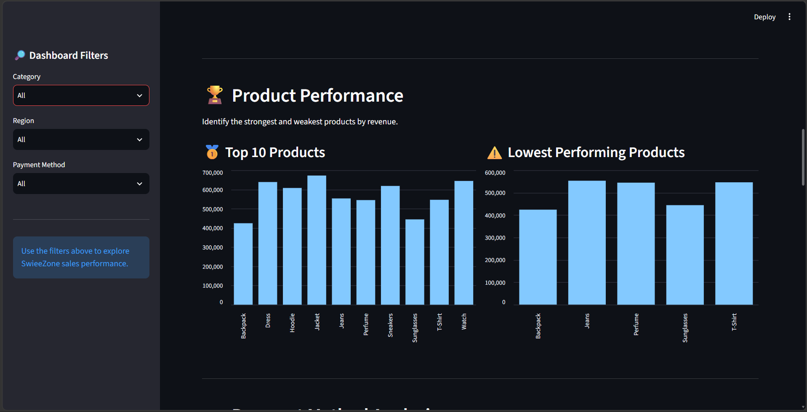
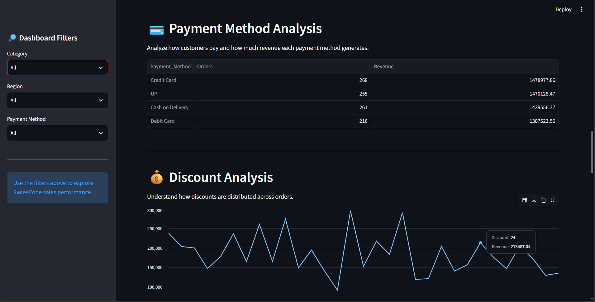
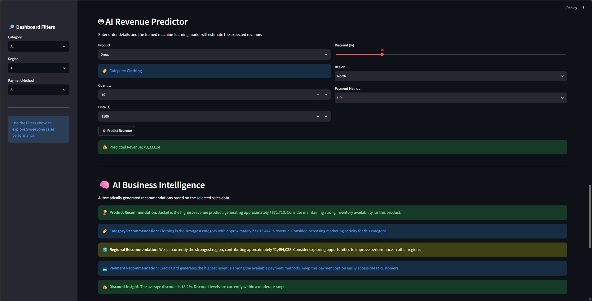

# SwieeZone AI Business Intelligence Dashboard


An end-to-end Business Intelligence and Data Science project built for a fictional e-commerce company, SwieeZone.


The project analyzes sales data, provides an interactive Business Intelligence dashboard, and uses Machine Learning to predict revenue based on business inputs.


---


## 🚀 Project Overview


SwieeZone AI Business Intelligence is an interactive analytics dashboard developed using Python and Streamlit.


The project is designed to help businesses understand their sales performance and make data-driven decisions.


The dashboard provides insights into:


- Sales performance

- Revenue trends

- Product performance

- Category performance

- Regional performance

- Payment method usage

- Discount impact

- Revenue prediction

- Automated business insights


The project combines:


**Data Analysis + Data Visualization + Machine Learning + Business Intelligence**


into a single interactive application.


---


## ✨ Key Features


## 📸 Dashboard Screenshots


### 1. Executive Dashboard





### 2. Analytics Dashboard





### 3. Revenue Trend


### 4. Product Performance





### 5. Product Analysis





### 6. AI Revenue Predictor





---


### 📊 Executive Dashboard


The dashboard provides important business KPIs such as:


- Total Orders

- Total Revenue

- Average Order Value

- Total Items Sold


These KPIs give a quick overview of the overall business performance.


---


### 📈 Sales Analytics


The application provides interactive visualizations for:


- Revenue by Category

- Revenue by Region

- Monthly Revenue Trends

- Top 10 Products

- Lowest Performing Products

- Payment Method Analysis

- Discount Analysis


Users can apply filters to analyze specific parts of the business.


---


### 🤖 AI Revenue Predictor


The project includes a Machine Learning model that predicts expected revenue based on business inputs.


The prediction uses features such as:


- Product

- Category

- Quantity

- Price

- Discount

- Region

- Payment Method


A **Random Forest Regressor** is used for revenue prediction.


---


### 💡 Automated Business Intelligence


The dashboard automatically generates business insights from the sales data.


The application identifies:


- Best-performing product

- Best-performing category

- Strongest region

- Most-used payment method

- Average discount observations


These insights help convert raw sales data into useful business information.


---


### 🔎 Data Explorer


The Data Explorer allows users to view and analyze the underlying sales dataset directly from the dashboard.


Users can inspect the available sales records and apply the available filters.


---


### 📥 CSV Data Export


Filtered sales data can be downloaded directly from the dashboard as a CSV file.


This allows users to perform additional analysis outside the application.


---


## 🛠️ Technologies Used


- **Python** – Core programming language

- **Pandas** – Data analysis and manipulation

- **NumPy** – Numerical operations

- **Scikit-learn** – Machine Learning

- **Streamlit** – Interactive dashboard

- **Matplotlib** – Data visualization

- **Joblib** – Model saving and loading

- **Git** – Version control

- **GitHub** – Source code management


---


## 🧠 Machine Learning


The project uses a **Random Forest Regression model** for revenue prediction.


### Machine Learning Workflow


1\. Load the sales dataset.

2\. Select the required business features.

3\. Separate numerical and categorical features.

4\. Preprocess the data.

5\. Train the Random Forest Regression model.

6\. Evaluate the model.

7\. Save the trained model.

8\. Load the trained model into the Streamlit application.

9\. Generate revenue predictions based on user inputs.


The trained model is stored in:


```text

models/swieeZone_revenue_model.pkl


📂 Dataset


The project uses a generated SwieeZone sales dataset.


The dataset contains information such as:


Order ID

Order Date

Product

Category

Quantity

Price

Discount

Revenue

Region

Payment Method


The dataset is stored at:


data/swieeZone_sales.csv

📁 Project Structure

SwieeZone_AI_Business_Intelligence/

│

├── data/

│   └── swieeZone_sales.csv

│

├── models/

│   └── swieeZone_revenue_model.pkl

│

├── screenshots/

│   ├── 1.Dashboard.png

│   ├── 2.Analytics.png

│   ├── 3.revenue trend.png

│   ├── 4.perfomance.png

│   ├── 5.analysis.png

│   └── 6.Predictor.png

│

├── app.py

├── create_data.py

├── train_model.py

├── README.md

├── .gitignore

└── .venv/

📄 File Description

app.py


Contains the Streamlit application and dashboard interface.


create_data.py


Generates the SwieeZone sales dataset.


train_model.py


Trains and saves the Machine Learning revenue prediction model.


data/swieeZone_sales.csv


Contains the sales data used for analysis and Machine Learning.


models/swieeZone_revenue_model.pkl


Contains the trained Machine Learning model.


screenshots/


Contains screenshots of the dashboard for project documentation and portfolio presentation.


README.md


Contains project documentation.


.gitignore


Specifies files and folders that should not be uploaded to GitHub, such as the virtual environment.


⚙️ How to Run the Project


Follow the steps below to run the SwieeZone AI Business Intelligence Dashboard on a computer.


1\. Install Python


Make sure Python is installed.


Check the installed Python version using:


python --version


If Python is installed correctly, the terminal will display the Python version.


2\. Clone the GitHub Repository


Download the project from GitHub using:


git clone https://github.com/charmithareddy/SwieeZone_AI_Business_Intelligence.git

3\. Open the Project Folder

cd SwieeZone_AI_Business_Intelligence

4\. Create a Virtual Environment

python -m venv .venv


A virtual environment keeps the libraries required by this project separate from other Python projects.


5\. Activate the Virtual Environment


For Windows PowerShell:


.venv\\Scripts\\Activate.ps1


After activation, you should see:


(.venv)


at the beginning of the terminal line.


6\. Install Required Libraries

pip install pandas numpy scikit-learn streamlit matplotlib joblib

7\. Generate the Sales Dataset

python create_data.py

8\. Train the Machine Learning Model

python train_model.py

9\. Start the Streamlit Dashboard

streamlit run app.py


If the browser does not open automatically, open:


http://localhost:8501

10\. Explore the Dashboard


Once the dashboard opens, you can:


View business KPIs

Filter sales by category

Filter sales by region

Filter sales by payment method

Analyze revenue trends

View top-performing products

View low-performing products

Analyze payment methods

Analyze discounts

Predict revenue using Machine Learning

View automated business insights

Explore the sales dataset

Download filtered data as a CSV file

🔄 Running the Project Again


After the project has already been installed and configured, you normally do not need to repeat all the setup steps.


Open PowerShell inside the project folder.


Activate the virtual environment:


.venv\\Scripts\\Activate.ps1


Then start the dashboard:


streamlit run app.py


If the dataset needs to be recreated:


python create_data.py


If the Machine Learning model needs to be retrained:


python train_model.py


Then start the dashboard again:


streamlit run app.py

📌 Project Highlights

End-to-end Data Science project

Interactive Business Intelligence dashboard

Machine Learning-based revenue prediction

Automated business insights

Interactive data filtering

Data visualization

CSV data export

Modular Python project structure

Git version control

GitHub repository

🎯 Future Improvements


Possible future enhancements include:


Customer segmentation

Sales forecasting

Advanced anomaly detection

Additional business KPIs

Database integration

Cloud deployment

Advanced recommendation systems

Real-world e-commerce data integration

👩‍💻 Author


Charmitha Reddy


GitHub:


https://github.com/charmithareddy


⭐ Project


SwieeZone AI Business Intelligence Dashboard


An end-to-end project combining:


Python + Data Analysis + Data Visualization + Machine Learning + Business Intelligence

